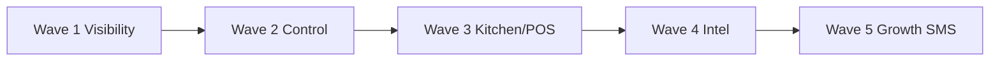

# Feature Implementation Waves

> **Status (2026-07-17):** Historical sequencing doc. Planned waves are largely shipped; use for context only. Confirm against current `apps/` + `backend/` before building anything listed as “new.”

**Bake & Grill — Safe implementation sequencing**  
**Generated:** 2026-05-29  
**Companion doc:** [FEATURE_ROADMAP_AUDIT.md](./FEATURE_ROADMAP_AUDIT.md)

This document turns the audit into **five deployable waves**. Each wave lists features, files to inspect, new artifacts, migrations, API endpoints, tests, rollback strategy, and dependencies.

**Principles**

- Server-side totals remain authoritative; waves 1–3 avoid changing payment capture logic.
- Prefer read-only admin endpoints first (Wave 1).
- Deploy to **test.bakeandgrill.mv** before production (see `.cursor/rules/deploy-commands.mdc`).
- Do not duplicate features marked **Full** in the audit (service charge, customer growth, ordering gates, referral payout).

---

## Wave overview

| Wave | Theme | Risk | Typical deploy |
|------|-------|------|----------------|
| 1 | Admin visibility + growth polish | Low | Quick pull (mostly UI + read APIs) |
| 2 | Operational control + fees | Medium | Full deploy if migrations |
| 3 | POS / KDS safety | Low–Medium | Quick pull + manual kitchen test |
| 4 | Delivery + inventory intelligence | Low | Quick pull |
| 5 | Advanced growth automation | Medium–High | Full deploy + SMS staging |



---

## Wave 1 — Low-risk, high-impact admin + growth polish

**Goal:** Give owners confidence before launch without touching payment capture or order totals logic.

### Features

| Feature | Priority | Notes |
|---------|----------|-------|
| System Health admin page | P0 | New `/system-health` route |
| Detailed health API | P0 | Extend stub controller |
| Dashboard v2 tiles | P0 | Payment split, SC total, delivery fees today |
| Online “Pay again” | P0 | `OrderStatusPage` when `payment_pending` / failed |
| Homepage “Order again” block | P1 | Logged-in users, last 3 orders |
| Loyalty earn preview in cart | P1 | Reuse checkout loyalty math |
| Checkout WhatsApp / support block | P1 | CMS phone/WhatsApp from public settings |
| Sync free-delivery threshold | P1 | Replace hardcoded `200` in online cart |
| Verify referral payout on staging | P0 | Manual + optional feature test |
| Enhance go-live checklist visibility | P2 | Link from dashboard or settings |

### Inspect (existing)

| File | Purpose |
|------|---------|
| `backend/app/Http/Controllers/Api/SystemHealthController.php` | Current stub — extend, don’t replace route blindly |
| `backend/routes/console.php` | `webhooks:check-failed`, `jobs:alert-failed`, `orders:cancel-stale` |
| `backend/app/Models/WebhookLog.php` (or equivalent) | BML failure counts |
| `backend/app/Models/SmsLog.php` | Failed SMS last 24h |
| `apps/admin-dashboard/src/pages/DashboardPage.tsx` | Add stat tiles |
| `apps/admin-dashboard/src/api/finance.ts` | `getDailySummary`, sales breakdown |
| `apps/online-order-web/src/pages/OrderStatusPage.tsx` | Pay-again entry point |
| `apps/online-order-web/src/pages/HomePage.tsx` | Reorder block |
| `apps/online-order-web/src/components/CartDrawer.tsx` | `FREE_DELIVERY_MVR` constant |
| `backend/app/Domains/Marketing/Listeners/RecordReferralRedemptionListener.php` | Referrer credit |

### New artifacts

| Artifact | Type |
|----------|------|
| `backend/app/Domains/System/Services/SystemHealthService.php` | Aggregator service |
| `backend/tests/Feature/SystemHealthTest.php` | Feature tests |
| `apps/admin-dashboard/src/pages/SystemHealthPage.tsx` | Admin UI |
| `apps/admin-dashboard/src/pages/__tests__/SystemHealthPage.test.tsx` | Vitest |
| `apps/admin-dashboard/src/api/system.ts` (or extend existing) | `fetchSystemHealthDetailed()` |

### API endpoints

| Method | Path | Auth | Response (example fields) |
|--------|------|------|----------------------------|
| GET | `/api/admin/system/health/detailed` | Staff + `website.manage` or owner | `failed_jobs_24h`, `webhook_failures_24h`, `payment_pending_stuck`, `sms_failed_24h`, `print_proxy_ok`, `queue_depth`, `checked_at` |
| GET | `/api/admin/system/health/failed-jobs` | Same | Paginated recent failures (optional v1.1) |
| GET | `/api/ordering/public-settings` or extend existing | Public | Include `delivery_free_threshold` for online sync |

**Dashboard tiles:** reuse existing report endpoints — no new backend required if `getDailySummary` + payment breakdown already expose needed fields.

### Migrations

**None expected** — read-only aggregates from `failed_jobs`, `webhook_logs`, `orders`, `sms_logs`.

### Tests

| Layer | Command / file |
|-------|----------------|
| Backend | `php artisan test --filter=SystemHealthTest` |
| Backend | `php artisan test --filter=RecordReferralRedemption` (if added) |
| Admin | `npm test -- SystemHealthPage` |
| Admin | Dashboard tile vitest (optional) |
| E2E | Extend `e2e/checkout.spec.ts` — failed payment → pay again |
| Manual | Staging BML sandbox; open `/admin/system-health`; compare with `php artisan queue:failed` |

### Rollback

- Remove admin route + nav link; revert controller to stub.
- Dashboard and online UI changes are cosmetic — revert frontend build only.
- No DB rollback needed.

### Risks & mitigations

| Risk | Mitigation |
|------|------------|
| Health endpoint slow on large `failed_jobs` | Limit to counts + last 10 rows; index `failed_at` |
| Print-proxy check false negative | Timeout 2s; show “unknown” not “down” |
| Pay-again double-charge | Reuse existing pending order id + idempotent BML session |

### Recommended implementation prompt (copy-paste)

> Implement **Wave 1: Owner System Health page + Dashboard v2 tiles + Online pay-again**. Add `GET /api/admin/system/health/detailed` aggregating failed_jobs count (last 24h), recent BML webhook failures, count of orders in `payment_pending` > 30min, SMS failed logs, and print-proxy reachability. Add admin route `/system-health` with permission `website.manage`. Extend Dashboard with today’s payment method split and service charge total (reuse existing report APIs). Add “Pay again” button on online order status when payment failed/pending. Include feature tests and vitest. Do not change BML credentials or payment capture logic.

---

## Wave 2 — Operational control

**Goal:** Reduce config/SSH dependency; optional new fee layer; richer finance reports.

### Features

| Feature | Priority | Notes |
|---------|----------|-------|
| Unified Ordering Control Center UX | P1 | Merge mental model of `/online-ordering` + `/delivery-settings` |
| Delivery zone & fee editor | P0 | Persist zones/threshold to site_settings or DB |
| Order cap / throttle settings | P2 | `ordering_max_per_slot` — new |
| Packaging fee (if approved) | P1 | Mirror service charge pattern |
| Small-order minimum fee | P2 | Optional combined with packaging |
| Ramadan/Eid schedule presets | P2 | Template JSON on top of weekly hours |
| Reports: credit AR, voids by staff, discounts by type | P1 | Extend ReportsService |

### Inspect (existing)

| File | Purpose |
|------|---------|
| `apps/admin-dashboard/src/pages/OnlineOrderingPage.tsx` | Gate UI |
| `apps/admin-dashboard/src/pages/DeliverySettingsPage.tsx` | Currently toggle/schedule only |
| `backend/app/Services/DeliveryGateService.php` | Zone whitelist logic |
| `backend/config/delivery.php` | Default zones/fees |
| `backend/app/Domains/Orders/Services/ServiceChargeCalculator.php` | Template for packaging fee |
| `backend/app/Domains/Orders/Services/OrderTotalsCalculator.php` | Insert new fee line |
| `backend/app/Domains/Reporting/Services/ReportsService.php` | New report sections |
| `apps/admin-dashboard/src/pages/ReportsPage.tsx` | New tabs/filters |

### New artifacts

| Artifact | Type |
|----------|------|
| `PackagingFeeCalculator.php` | Domain service (if approved) |
| `PackagingFeeSettingsController.php` | Admin API |
| `DeliveryZoneSettingsController.php` or extend site settings | Zone CRUD |
| Migration: `packaging_fee_laar` on `orders` | If fee approved |
| Migration: seed site_settings for zones/threshold | If moving off env |
| `PackagingFeeTest.php` | Backend tests |

### API endpoints

| Method | Path | Purpose |
|--------|------|---------|
| GET/PATCH | `/api/admin/delivery/zones` | Zone + fee CRUD |
| GET/PATCH | `/api/admin/settings/packaging-fee` | Packaging fee config |
| GET | `/api/reports/discounts-by-type` | Promo/loyalty/gift/referral split |
| GET | `/api/reports/voids-by-staff` | Audit-backed |
| GET | `/api/reports/credit-exposure` | Unpaid credit orders |

### Migrations

- Optional: `orders.packaging_fee_laar`, `orders.small_order_fee_laar`
- Optional: `site_settings` keys `delivery_zones_json`, `delivery_free_threshold`
- Optional: `ordering_settings.max_orders_per_15min`

### Tests

```bash
php artisan test --filter=PackagingFee
php artisan test --filter=DeliveryGate
php artisan test --filter=ReportsService
# Snapshot tests if report JSON shape changes
php artisan test tests/Feature/Reports/
```

### Rollback

- Disable packaging fee via settings (`enabled: false`) before code revert.
- Zone settings: keep env fallback in `DeliveryGateService` until DB proven stable.
- Report endpoints additive — safe to leave unused.

### Risks

- **Fee order in totals** — document: subtotal → discounts → service charge → packaging → delivery → tax.
- **Zone JSON invalid** — validate schema on PATCH; fallback to config file.

---

## Wave 3 — POS / KDS safety

**Goal:** Kitchen and floor staff see the same urgency data; reduce offline confusion.

### Features

| Feature | Priority | Notes |
|---------|----------|-------|
| KDS standalone SSE + elapsed/urgency | P0 | Port from admin `KDSPage.tsx` |
| Sound alerts in kds-web | P1 | New ticket + late ticket |
| POS held-ticket aging warnings | P1 | `OpenTicketsPanel.tsx` |
| Offline conflict resolution UI | P1 | `OfflineSyncPanel.tsx` |
| Manager override report | P2 | From audit logs |

### Inspect (existing)

| File | Purpose |
|------|---------|
| `apps/admin-dashboard/src/pages/KDSPage.tsx` | Reference implementation |
| `apps/admin-dashboard/src/hooks/useSse.ts` | SSE hook to copy/adapt |
| `apps/kds-web/src/App.tsx` | Polling-only today |
| `backend/app/Http/Controllers/Api/KdsController.php` | Bump/recall/stream |
| `backend/app/Domains/Realtime/Services/KdsStreamProvider.php` | SSE payload |
| `apps/pos-web/src/components/OpenTicketsPanel.tsx` | Add elapsed badges |
| `apps/pos-web/src/components/OfflineSyncPanel.tsx` | Conflict UI |
| `apps/pos-web/src/offline/syncEngine.ts` | Conflict status |
| `backend/app/Http/Controllers/Api/AuditLogController.php` | Override export |

### New artifacts

| Artifact | Type |
|----------|------|
| `apps/kds-web/src/hooks/useKdsSse.ts` | SSE client |
| `apps/kds-web/src/utils/urgencyColor.ts` | Shared urgency (optional move to `@shared`) |
| `apps/pos-web/src/components/ConflictResolveModal.tsx` | POS UI |
| Extend `KdsBumpEventsTest.php` | If stream shape changes |

### API endpoints

**No new endpoints required** — reuse:

- `GET /api/kds/orders`
- `GET /api/kds/stream` (SSE)
- `POST /api/kds/orders/{id}/bump|recall|start`

### Migrations

None.

### Tests

```bash
php artisan test --filter=KdsBumpEvents
# POS unit tests if present
npm test --prefix apps/kds-web  # if configured
# E2E
npx playwright test e2e/kds-flow.spec.ts
```

**Manual:** Run kds-web on kitchen tablet 4+ hours; verify SSE reconnect; iPad Safari POS offline → online conflict flow.

### Rollback

- Feature flag env `KDS_USE_SSE=false` fallback to polling in kds-web.
- POS aging is display-only — revert UI safely.

### Risks

- SSE through nginx — increase `proxy_read_timeout` if disconnects.
- Sound permissions — user gesture may be required on iOS Safari.

---

## Wave 4 — Delivery + inventory intelligence

**Goal:** Owner sees margin/stock/delivery performance without new transactional paths.

### Features

| Feature | Priority | Notes |
|---------|----------|-------|
| Driver settlement / cash view | P2 | Admin delivery page tab |
| Delivery zone performance report | P1 | Orders by zone, avg fee |
| Stock-out forecast widget | P1 | Dashboard or inventory page |
| Menu item margin warning | P2 | Compare cost vs price |
| Waste trend chart | P1 | Extend `WasteLogsPage.tsx` |
| Low-stock consolidation widget | P1 | Single dashboard card |
| Prepared stock admin UI | P2 | Wire existing API |

### Inspect (existing)

| File | Purpose |
|------|---------|
| `apps/admin-dashboard/src/pages/SupplierIntelligencePage.tsx` | Patterns |
| `apps/admin-dashboard/src/pages/ForecastPage.tsx` | Item forecast API |
| `apps/admin-dashboard/src/pages/WasteLogsPage.tsx` | Waste CRUD |
| `apps/admin-dashboard/src/pages/InventoryPage.tsx` | Low stock |
| `apps/admin-dashboard/src/pages/DeliveryPage.tsx` | Driver stats |
| `apps/delivery-web/src/` | Driver-facing flows |
| `backend/app/Http/Controllers/Api/ForecastController.php` | Forecast data |
| `backend/app/Http/Controllers/Api/WasteLogController.php` | Waste data |

### New artifacts

| Artifact | Type |
|----------|------|
| `DeliveryZoneReportService.php` | Optional |
| `GET /api/reports/delivery-zones` | Optional dedicated endpoint |
| Dashboard widgets / Inventory tab components | Frontend |

### Migrations

None unless caching forecast snapshots (optional).

### Tests

```bash
php artisan test --filter=Forecast
php artisan test --filter=WasteLog
# Report aggregation tests
```

### Rollback

Read-only reports — revert UI only.

---

## Wave 5 — Advanced growth automation

**Goal:** Automated CRM campaigns with strict consent and idempotency.

### Features

| Feature | Priority | Notes |
|---------|----------|-------|
| Customer `date_of_birth` field | P1 | Migration + admin + customer profile |
| Birthday loyalty/SMS job | P1 | Scheduled daily; `sms_opt_in` required |
| Abandoned cart recovery SMS | P0 | Server-side cart snapshots or checkout intent |
| Frequently bought together | P2 | Batch job from order lines |
| Combo/bundle admin builder | P2 | New promo type or item bundles |
| Near-tier checkout prompt | P1 | Wave 1 candidate moved here if deferred |

### Inspect (existing)

| File | Purpose |
|------|---------|
| `backend/app/Domains/Customers/Services/CustomerSegmentationService.php` | Segments |
| `backend/app/Domains/Notifications/Services/SmsService.php` | Idempotency |
| `backend/app/Domains/Loyalty/` | Tier thresholds |
| `backend/app/Domains/Marketing/` | Promotions |
| `apps/online-order-web/src/hooks/useCart.ts` | localStorage cart today |

### New artifacts

| Artifact | Type |
|----------|------|
| Migration: `customers.date_of_birth` | Nullable date |
| `abandoned_carts` table | token, customer_id, items_json, reminded_at |
| `SendBirthdayOffersJob` | Scheduled |
| `SendAbandonedCartSmsJob` | Scheduled with idempotency key |
| `AbandonedCartController` | POST snapshot from online checkout |
| Admin: campaign settings for timing (1h / 24h) | Settings page |

### API endpoints

| Method | Path | Purpose |
|--------|------|---------|
| POST | `/api/customer/cart/snapshot` | Optional authenticated abandon tracking |
| PATCH | `/api/customer/profile` | Include DOB |
| GET/PATCH | `/api/admin/marketing/abandoned-cart` | Enable + templates |

### Migrations

- `customers.date_of_birth`
- `abandoned_carts` + indexes on `customer_id`, `reminded_at`
- Optional `marketing_automation_settings` site_settings keys

### Tests

```bash
php artisan test --filter=Birthday
php artisan test --filter=AbandonedCart
php artisan test --filter=SmsService  # idempotency
```

**Manual:** Staging SMS only; verify no duplicate sends; verify opt-out honored.

### Rollback

- Disable jobs via `marketing.abandoned_cart_enabled=false`.
- DOB column nullable — safe to stop job without migration rollback.

### Risks (highest in roadmap)

| Risk | Mitigation |
|------|------------|
| SMS spam / cost | Max 1 reminder per cart; idempotency keys |
| GDPR/consent | Only `sms_opt_in` customers; log in `sms_logs` |
| Cart PII in DB | TTL delete after 7 days |

---

## Cross-wave dependencies

| Dependency | Blocks |
|------------|--------|
| Wave 1 health API | Owner sign-off for launch |
| Wave 1 free-threshold sync | Accurate cart progress (Wave 2 zone editor should update same public API) |
| Wave 2 packaging fee | Receipt/report labels must match Wave 1 dashboard tiles |
| Wave 3 KDS SSE | Kitchen go-live on `/kds/` URL |
| Wave 5 abandoned cart | Privacy policy + SMS opt-in copy on checkout |

---

## Supersedes / stale documentation

This wave plan and [FEATURE_ROADMAP_AUDIT.md](./FEATURE_ROADMAP_AUDIT.md) **supersede** prioritization in:

| Document | Status |
|----------|--------|
| [CONVERSION_GROWTH_AUDIT.md](../CONVERSION_GROWTH_AUDIT.md) | **Partially stale** — see audit §5 for QW2, QW6, QW7, MT2, MT4 corrections |
| [.cursor/rules/admin-panel-audit.mdc](../.cursor/rules/admin-panel-audit.mdc) | **Partially stale** — hidden pages and “22 missing pages” largely addressed; bug list may still apply |
| Plan file `.cursor/plans/feature_roadmap_audit_*.plan.md` | Planning artifact only — not runtime docs |

When implementing a feature, **verify in code** before trusting any older checklist.

---

## Deploy checklist (all waves)

1. Merge to `main`; build frontends into `backend/public/`.
2. Deploy to **test** first (`deploy-commands.mdc`).
3. Run backend tests + targeted filter.
4. Smoke: admin page, one order path, kitchen KDS if Wave 3.
5. Production only on explicit user request.

---

*End of implementation waves. Strategic context: [FEATURE_ROADMAP_AUDIT.md](./FEATURE_ROADMAP_AUDIT.md)*
