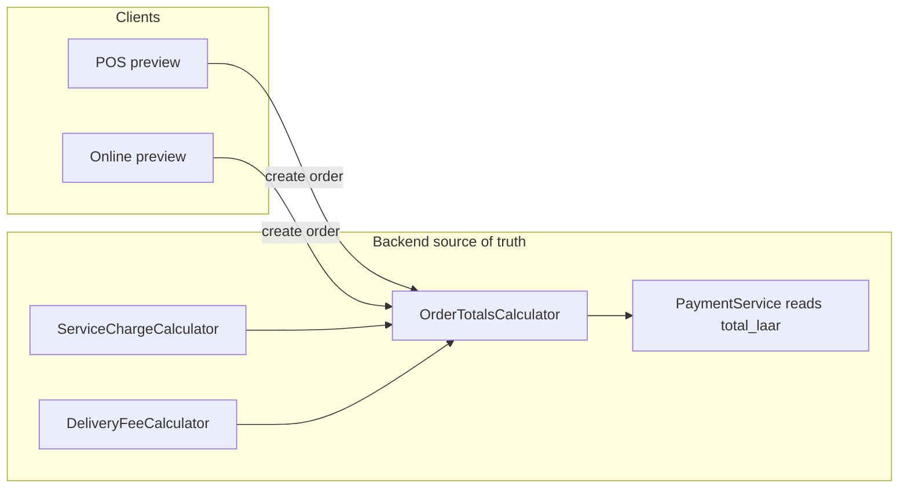

# Feature Roadmap Audit

> **Status (2026-07-17):** Historical. Waves 1–5 features listed below (system health, packaging fees, delivery zones, abandoned cart, KDS SSE/sound, offline sync UI, homepage reorder, loyalty earn preview, etc.) are implemented in the repo. Do not treat “Missing” rows as a live backlog without re-checking code. Prefer new product requests over re-implementing this audit.

**Bake & Grill — Repo-aware feature audit**  
**Generated:** 2026-05-29  
**Method:** Code inspection of backend routes, domains, models, migrations, tests, and all React apps. Existing markdown audits were cross-checked against code; several are partially stale (see §5 and [FEATURE_IMPLEMENTATION_WAVES.md](./FEATURE_IMPLEMENTATION_WAVES.md)).

**Companion doc:** [FEATURE_IMPLEMENTATION_WAVES.md](./FEATURE_IMPLEMENTATION_WAVES.md)

---

## 1. Executive summary

Bake & Grill is a **production-capable café operating system**: Laravel 12 API, admin dashboard (~40 pages), POS PWA (offline sync), online ordering, standalone KDS, driver app, print-proxy, BML payments, loyalty, referrals, gift cards, inventory, finance, SMS, and CRM growth tooling.

**Strengths today**

- Authoritative money math on the server (`OrderTotalsCalculator`, laari integers, locked paid orders).
- Broad admin coverage: most backend endpoints have UI and sidebar links.
- Recent high-value builds: **service charge**, **customer growth CRM**, **online ordering gates**, **delivery fee + free threshold**, **referral referrer payout**.

**Biggest gaps (money + ops)**

1. **Owner visibility** — system health is scheduler-only; admin health API is a stub; no unified alert center.
2. **KDS parity** — standalone `kds-web` polls HTTP; admin embedded KDS has SSE, urgency colors, and sound.
3. **Fee flexibility** — no packaging or small-order surcharge layer (service charge + delivery only).
4. **Growth automation** — no abandoned-cart recovery; birthday is tag-only (no DOB field); homepage lacks “welcome back / order again” for returning customers.
5. **Delivery settings UX** — zones/fees live in config/site_settings; admin nav overstates what `/delivery-settings` edits.

**Do not rebuild:** service charge, customer growth dashboard, online ordering pause, referral payout listener, cart upsell, free-delivery progress bar, menu star ratings, loyalty tier UI on account — these exist in code. Focus on **polish, exposure, testing, and staging verification**.

---

## 2. Existing system map

### 2.1 Technology stack

| Layer | Technology |
|-------|------------|
| Backend | Laravel 12, PHP 8.2+, Sanctum |
| Database | PostgreSQL (prod); SQLite in tests |
| Cache / queue | Redis |
| Admin UI | React 18 + TypeScript + Vite (`apps/admin-dashboard`) |
| POS | React PWA + IndexedDB offline (`apps/pos-web`) |
| Online | React (`apps/online-order-web`) |
| KDS | React (`apps/kds-web`) + admin embedded KDS |
| Delivery | React driver app (`apps/delivery-web`) |
| Shared | `packages/shared` (`@shared` types, service charge preview) |
| Print | Node Express ESC/POS proxy (`print-proxy/`) |
| Payments | BML (primary online), cash/card/credit on POS |
| SMS | Dhiraagu (`SmsService`, GSM-7 vs UCS-2 segments) |
| E2E | Playwright (`e2e/`, targets test.bakeandgrill.mv) |

### 2.2 Backend surface area

| Area | Scale | Key paths |
|------|-------|-----------|
| API controllers | ~89 | `backend/app/Http/Controllers/Api/` |
| Domain modules | 25 | `backend/app/Domains/` (Orders, Payments, Customers, Loyalty, Reporting, Realtime, …) |
| Models | 93 | `backend/app/Models/` |
| Migrations | 179 | `backend/database/migrations/` |
| Feature tests | 87 | `backend/tests/Feature/` |
| Main routes | `backend/routes/api.php` | Staff, customer, driver, public, webhooks |
| Finance routes | `backend/routes/api_finance.php` | Invoices, P&L, forecasts, supplier intel |

### 2.3 API route groups (summary)

- **Public:** health, menu, specials, reviews, gift-card balance, promo validate, ordering eligibility/status, BML webhook, order track token.
- **Staff:** orders lifecycle, KDS bump/recall, shifts/cash, reports (sales/X/Z), inventory, purchases, CRM, SMS module, settings (site, service charge, online ordering, delivery), devices, tables, refunds, print jobs, POS admin, audit logs.
- **Customer:** profile, orders, addresses, loyalty, gift cards, referrals, favorites, pre-orders, stream ticket.
- **Driver:** deliveries list, status updates, location push.
- **Finance (staff):** invoices, expenses, tax/P&L/cash-flow, forecasts, supplier performance.

### 2.4 Frontend apps and deploy paths

| App | Source | Built to |
|-----|--------|----------|
| Admin | `apps/admin-dashboard` | `backend/public/admin/` |
| POS | `apps/pos-web` | `backend/public/pos/` |
| Online | `apps/online-order-web` | `backend/public/order/` |
| KDS | `apps/kds-web` | `backend/public/kds/` |
| Driver | `apps/delivery-web` | `backend/public/driver/` |

### 2.5 Money flow (authoritative)



---

## 3. Features already built

Verified in code (not exhaustive — highlights):

| Category | Feature | Evidence |
|----------|---------|----------|
| Admin | 40+ routed pages, permission-guarded | `apps/admin-dashboard/src/App.tsx`, `navConfig.ts` |
| Admin | Customer Growth CRM (segments, metrics, 360 drawer) | `CustomerGrowthPage.tsx`, `AdminCustomerGrowthController.php` |
| Admin | Service charge settings | `ServiceChargeSettings.tsx`, `ServiceChargeSettingsController.php` |
| Admin | Online ordering gate + schedules | `OnlineOrderingPage.tsx`, `OnlineOrderingGateService` |
| Admin | Reports (9 tabs), P&L, forecasts, supplier intel | `ReportsPage.tsx`, `api_finance.php` |
| Admin | Gift cards, reviews, specials, refunds, waste, tables, shifts, devices | respective `pages/` |
| POS | Offline sync, PWA update banner, split tender, credit account | `offline/syncEngine.ts`, `ChargeOverlay.tsx`, `usePosAppUpdate.ts` |
| POS | Open/hold tickets, service charge preview | `OpenTicketsPanel.tsx`, `useCart.ts` + `@shared/utils/serviceCharge` |
| Online | Checkout, loyalty/referral/gift card, service charge preview | `useCheckout.ts`, `CheckoutPage.tsx` |
| Online | Cart upsell, free delivery progress, menu ratings, reorder | `CartDrawer.tsx`, `MenuCard.tsx`, `OrderHistoryPage.tsx` |
| Online | Loyalty tier progress on account | `AccountPage.tsx` |
| KDS | Bump/recall/start API | `KdsController.php`, `KdsBumpEventsTest.php` |
| KDS | Admin KDS: SSE, urgency colors, sound | `admin-dashboard/.../KDSPage.tsx` |
| Delivery | Driver app status workflow, location push | `delivery-web`, `DeliveryDriverController.php` |
| Backend | Referral referrer payout on paid order | `RecordReferralRedemptionListener.php` |
| Backend | Stale payment_pending cleanup | `orders:cancel-stale` in `routes/console.php` |
| Backend | Inventory forecasts, waste logs, purchase workflow | `ForecastController`, `WasteLogController` |
| Tests | Service charge (15 cases), customer growth, KDS, payments, gates | `tests/Feature/` |

---

## 4. Features partially built

| Feature | What exists | What's missing |
|---------|-------------|----------------|
| Customer 360 | Composite via `GET admin/customers/{id}`, growth-summary, activity, credit, tags | Single “360” API resource; drawer is admin-only assembly |
| System health | Scheduler: `webhooks:check-failed`, `jobs:alert-failed`, `orders:cancel-stale`; dashboard widget | Rich `GET /admin/system/health` (stub only); no alert center UI |
| KDS late monitor | Full in admin `KDSPage.tsx` | Not in standalone `kds-web` (polling only) |
| Delivery ETA | `delivery_eta_at`, `desired_eta` fields; static CMS copy on checkout | No live ETA engine or driver-ETA API for customers |
| Delivery zone/fee admin | `DeliveryGateService`, site_settings seeds, public `/ordering/delivery-status` | `/delivery-settings` is toggle/schedule only; no zone/fee editor |
| Waste tracking | `WasteLogController`, admin page, P&L inclusion | No dedicated `/waste-logs/summary` endpoint; summary derived client-side |
| Payment failure recovery | Checkout reuses `pendingOrderId`; POS retry payment | No “Pay again” on online `OrderStatusPage` |
| Offline conflict (POS) | `syncEngine` marks `conflict` status | No per-order resolve UI in `OfflineSyncPanel` |
| Prepared stock | Backend `prepared-stock` endpoints | No admin UI |
| Supplier CRUD | Performance/ratings/compare in admin | No create/edit supplier UI (`POST/PATCH/DELETE /suppliers`) |
| Manual PO / inventory SKU create | Receive/approve/suggest/import | No `POST /purchases` or `POST /inventory` in admin API layer |
| Birthday / loyalty | Ledger `event` allows `birthday`; CRM tag “Birthday Month” | No `date_of_birth` on Customer; no scheduled birthday job |
| Pickup time slots | Reservation slots (`/reservations/availability`) | Not used for online pickup order caps or slot booking |
| Specials on menu page | Homepage specials | Verify menu page prominence (homepage has specials; menu may vary by build) |
| Homepage personalization | Order history + reorder API | No “welcome back” block on `HomePage.tsx` for logged-in users |

---

## 5. Features missing

| Feature | Notes |
|---------|-------|
| Packaging fee | No order column or calculator |
| Small order / minimum order fee | `config/ordering.php` may define minimum; no separate surcharge fee layer |
| Abandoned cart recovery | Cart in `localStorage` only; no server cart or SMS recovery |
| Order cap / max orders per time slot (online) | No backend setting found |
| Ramadan/Eid schedule presets | Generic weekly schedules only via site settings |
| Corporate / office ordering | Not present |
| Campaign A/B testing | Not present |
| Unified admin alert center | Not present |
| Dedicated `/system-health` admin page | Not present |
| Frequently bought together (data-driven) | Not present |
| Combo/bundle builder | Promos support fixed/percent; not true bundle SKUs |
| Driver cash settlement (restaurant-side) | Driver stats only |
| Proof of delivery photo | Not present |
| Embedded maps in driver app | External Google Maps link only |

### Stale documentation warning

These files contain **outdated claims** (verified against code 2026-05-29):

| Doc | Stale claim | Current code |
|-----|-------------|--------------|
| [CONVERSION_GROWTH_AUDIT.md](../CONVERSION_GROWTH_AUDIT.md) | QW2: No cart upsell | **Built** — `CartDrawer.tsx` “Add to your order” |
| Same | QW6: No free delivery progress | **Built** — `CartDrawer.tsx` + `config/delivery.php` `free_threshold` |
| Same | QW7: Reviews invisible on menu | **Built** — `MenuCard.tsx` ratings |
| Same | MT2: Referral reward never pays out | **Built** — `RecordReferralRedemptionListener.php` |
| Same | MT4: Loyalty tiers invisible | **Built** — `AccountPage.tsx` tier progress |
| [.cursor/rules/admin-panel-audit.mdc](../.cursor/rules/admin-panel-audit.mdc) | 7 hidden pages, 22 missing pages | **Mostly resolved** — sidebar now links SMS, loyalty, analytics, P&L, etc. |

**Source of truth:** this audit + code. Supersedes older checklists for prioritization.

---

## 6. Highest-value admin features

Ranked for small café practicality (admin control, reporting accuracy, fewer mistakes).

| Feature | Business impact | Risk | Effort | Production safety | Repo support | Phase |
|---------|-----------------|------|--------|-------------------|--------------|-------|
| System Health admin page | High | Low | Medium | Safe before launch | Partial | **Now** |
| Owner dashboard v2 (payment split, SC, delivery fees, credit exposure) | High | Low | Medium | Safe before launch | Partial | **Now** |
| Delivery zone & fee editor in admin | High | Medium | Medium | Safe before launch | Partial | 30 days |
| Unified Ordering Control Center (merge online + delivery settings UX) | Medium | Low | Medium | Safe before launch | Full | 30 days |
| Packaging / small-order fee settings | Medium | Medium | Medium | Better after launch | Missing | 30 days |
| Ramadan/Eid schedule presets | Medium | Low | Low | Safe before launch | Partial | 30 days |
| Max orders per time slot | Medium | Medium | Medium | Better after launch | Missing | 60 days |
| Prepared stock admin UI | Medium | Low | Medium | Safe before launch | Partial | 60 days |
| Supplier CRUD UI | Medium | Low | Medium | Safe before launch | Partial | 60 days |
| Manual purchase order create | Medium | Medium | Medium | Better after launch | Partial | 60 days |
| Go-live checklist inside admin (enhance TestChecklistPage) | Medium | Low | Low | Safe before launch | Partial | **Now** |

**Already built — do not re-implement:** service charge (`Settings → Ordering & Charges`), online ordering pause (`/online-ordering`), customer growth (`/customers/growth`).

---

## 7. Highest-value customer growth features

| Feature | Business impact | Risk | Effort | Production safety | Repo support | Phase |
|---------|-----------------|------|--------|-------------------|--------------|-------|
| Homepage “order again” for logged-in users | High | Low | Low | Safe before launch | Partial | **Now** |
| Online pay-again after failed BML | High | Low | Low | Safe before launch | Partial | **Now** |
| Loyalty earn preview in cart (not only checkout) | Medium | Low | Low | Safe before launch | Partial | **Now** |
| First-order promo banner (CMS announcement) | High | Low | Low | Safe before launch | Full | **Now** |
| Specials section at top of menu page | Medium | Low | Low | Safe before launch | Partial | **Now** |
| Abandoned cart SMS recovery | High | Medium | High | Better after launch | Missing | 60 days |
| Birthday DOB + automated offer | Medium | Medium | Medium | Better after launch | Partial | 60 days |
| Near-tier-upgrade prompt at checkout | Medium | Low | Low | Safe before launch | Partial | 30 days |
| Post-order points celebration on status page | Medium | Low | Low | Safe before launch | Partial | 30 days |
| Customer merge / data quality (expose more in CRM) | Medium | Low | Low | Safe before launch | Full | 30 days |

**Already built:** Customer growth dashboard, segments, 360 drawer, tags, follow-up notes, merge, credit ledger, referral discount + referrer payout, gift cards, loyalty tiers on account.

---

## 8. Highest-value POS features

| Feature | Business impact | Risk | Effort | Production safety | Repo support | Phase |
|---------|-----------------|------|--------|-------------------|--------------|-------|
| KDS parity in standalone app (see §10) | High | Low | Medium | Safe before launch | Partial | **Now** |
| Held/open ticket aging warnings | Medium | Low | Low | Safe before launch | Partial | 30 days |
| Offline conflict resolution UI | Medium | Medium | Medium | Better after launch | Partial | 30 days |
| Cash drawer mismatch explanation on close shift | Medium | Low | Medium | Safe before launch | Partial | 30 days |
| Void/refund reason analysis report | Medium | Low | Medium | Safe before launch | Partial | 30 days |
| Manager override history report | Medium | Low | Medium | Safe before launch | Partial | 30 days |
| Staff shift performance (sales per cashier) | Medium | Low | Medium | Safe before launch | Partial | 30 days |

**Already built:** PWA update prompt, offline sync, split tender (online), credit/house account, open tickets, service charge preview, shift open/close, cash movements, device registration, retry payment flow in `useOrderCreation`.

---

## 9. Highest-value online ordering features

| Feature | Business impact | Risk | Effort | Production safety | Repo support | Phase |
|---------|-----------------|------|--------|-------------------|--------------|-------|
| Pay again on order status | High | Low | Low | Safe before launch | Partial | **Now** |
| Checkout WhatsApp / support block | Medium | Low | Low | Safe before launch | Partial | **Now** |
| Homepage reorder block | High | Low | Low | Safe before launch | Partial | **Now** |
| Delivery fee explanation before checkout | Medium | Low | Low | Safe before launch | Partial | **Now** |
| Loyalty earn in cart drawer | Medium | Low | Low | Safe before launch | Partial | **Now** |
| Sync FREE_DELIVERY_MVR with backend public settings | Medium | Low | Low | Safe before launch | Partial | **Now** |
| Abandoned cart recovery | High | Medium | High | Better after launch | Missing | 60 days |
| Frequently bought together | Medium | Medium | High | Better after launch | Missing | Later |
| Combo/bundle display | Medium | Medium | Medium | Better after launch | Partial | Later |

**Already built:** Service charge preview, free delivery progress bar, cart upsell, menu star ratings, loyalty/referral/gift card at checkout, tier progress on account, order history reorder, pending order reuse on payment retry at checkout.

---

## 10. Highest-value KDS / kitchen features

| Feature | Business impact | Risk | Effort | Production safety | Repo support | Phase |
|---------|-----------------|------|--------|-------------------|--------------|-------|
| Port SSE + elapsed/urgency to `kds-web` | High | Low | Medium | Safe before launch | Partial | **Now** |
| Sound alerts for new/late tickets in `kds-web` | Medium | Low | Low | Safe before launch | Partial | **Now** |
| Station/kitchen routing filter | Medium | Medium | Medium | Better after launch | Partial | 60 days |
| Prep-time target per item (use `prep_time_minutes`) | Medium | Low | Medium | Better after launch | Partial | 60 days |
| Kitchen bottleneck dashboard | Medium | Low | Medium | Better after launch | Partial | 60 days |
| Item 86/unavailable from KDS | Medium | Medium | Medium | Better after launch | Partial | 60 days |

**Already built:** Bump/recall/start API, admin KDS with SSE and urgency (8m / 15m), item availability toggle via admin/menu API.

---

## 11. Highest-value delivery features

| Feature | Business impact | Risk | Effort | Production safety | Repo support | Phase |
|---------|-----------------|------|--------|-------------------|--------------|-------|
| Admin delivery zone performance report | Medium | Low | Medium | Safe before launch | Partial | 30 days |
| Customer-facing live ETA (optional) | Medium | Medium | High | Better after launch | Partial | 60 days |
| Driver settlement / cash reconciliation view | Medium | Medium | Medium | Better after launch | Partial | 60 days |
| Delivery delay alerts (admin) | Medium | Low | Medium | Safe before launch | Partial | 30 days |
| Proof of delivery photo | Low | Medium | Medium | Better after launch | Missing | Later |

**Already built:** Driver assign on admin Delivery page, driver app status stepper, location push, Google Maps link, earnings stats, zone whitelist via `DeliveryGateService`, delivery fee calculator with free threshold.

---

## 12. Highest-value inventory / stock features

| Feature | Business impact | Risk | Effort | Production safety | Repo support | Phase |
|---------|-----------------|------|--------|-------------------|--------------|-------|
| Low-stock alert dashboard (consolidate existing) | High | Low | Medium | Safe before launch | Partial | 30 days |
| Stock-out / predicted depletion widget | Medium | Low | Medium | Safe before launch | Partial | 60 days |
| Recipe cost change warning | Medium | Medium | Medium | Better after launch | Partial | 60 days |
| Profit margin warning on menu items | Medium | Medium | Medium | Better after launch | Partial | 60 days |
| Waste trend chart (extend WasteLogsPage) | Medium | Low | Low | Safe before launch | Partial | 30 days |
| Fast/slow moving stock report | Medium | Low | Medium | Safe before launch | Partial | 60 days |

**Already built:** Inventory page (stock, categories, conversions, stock count), purchase orders (approve/receive/suggest/import), supplier intelligence page, inventory valuation report, `inventory:check-reorder` scheduler, forecasts API, waste log CRUD.

---

## 13. Highest-value reporting / finance features

| Feature | Business impact | Risk | Effort | Production safety | Repo support | Phase |
|---------|-----------------|------|--------|-------------------|--------------|-------|
| Dashboard: today payment method split | High | Low | Low | Safe before launch | Full | **Now** |
| Dashboard: service charge + delivery fee totals | High | Low | Low | Safe before launch | Full | **Now** |
| Discounts by type (promo/loyalty/gift/referral) | Medium | Low | Medium | Safe before launch | Partial | 30 days |
| Refunds by reason | Medium | Low | Medium | Safe before launch | Partial | 30 days |
| Voids by staff | Medium | Low | Medium | Safe before launch | Partial | 30 days |
| Credit sales / unpaid balance summary | High | Low | Medium | Safe before launch | Partial | 30 days |
| Customer LTV report with date filters | Medium | Low | Medium | Safe before launch | Partial | 30 days |
| Product margin report | Medium | Medium | Medium | Better after launch | Partial | 60 days |
| Shift cash difference report | Medium | Low | Medium | Safe before launch | Partial | 30 days |

**Already built:** Sales summary, breakdown, X/Z reports, tax report, P&L, cash flow, daily summary, AR/AP, promotions report, loyalty report, service_charge_total in ReportsService, analytics page, forecast page.

---

## 14. Highest-value system health / monitoring features

| Feature | Business impact | Risk | Effort | Production safety | Repo support | Phase |
|---------|-----------------|------|--------|-------------------|--------------|-------|
| Admin System Health page | High | Low | Medium | Safe before launch | Partial | **Now** |
| Failed queue jobs dashboard | High | Low | Medium | Safe before launch | Partial | **Now** |
| BML webhook failure monitor | High | Low | Low | Safe before launch | Partial | **Now** |
| Stuck `payment_pending` orders list | High | Low | Low | Safe before launch | Full | **Now** |
| SMS failure monitor | Medium | Low | Low | Safe before launch | Partial | **Now** |
| Print-proxy reachability check | Medium | Low | Low | Safe before launch | Partial | **Now** |
| KDS/SSE connection status | Medium | Low | Low | Safe before launch | Partial | 30 days |
| Scheduler last-run monitor | Medium | Low | Medium | Safe before launch | Partial | 30 days |
| Backup/storage health | Medium | Medium | Medium | Better after launch | Missing | Later |

**Already built:** Public `/health`, minimal admin health JSON, cron commands (`webhooks:check-failed`, `jobs:alert-failed`, `orders:cancel-stale`), dashboard health widget, POS maintenance cleanup API, TestChecklistPage (non-prod).

---

## 15. Risk assessment

### 15.1 Money and totals (critical)

- **Never trust frontend totals** — POS/online previews are estimates; `OrderTotalsCalculator` + locked snapshots on paid orders are authoritative.
- **Service charge / delivery / tax** — changes affect BML `total_laar`; test sandbox payments after any totals change.
- **Refunds** — capped at paid amount; full refund must include service charge once in `total_laar` (covered by `ServiceChargeTest`).

### 15.2 Payments and webhooks

- BML production credentials must not be committed or changed casually.
- Webhook idempotency and `webhooks:check-failed` scheduler exist — surface failures in admin before launch.
- Stale `payment_pending` auto-cancel runs every 5 minutes — monitor counts in health page.

### 15.3 POS offline

- Offline gate requires cached shift, menu, token — test iPad Safari per `docs/OFFLINE_POS_IPAD_CHECKLIST.md`.
- Split tender blocked offline — intentional.
- Conflict status set in sync engine but not resolved in UI — operational risk if staff go offline often.

### 15.4 SMS and marketing

- Unicode (Dhivaahi) uses 70 chars/segment — validate in admin SMS module.
- Opt-in required for promotional SMS; use `sms_opt_in` segments in CRM.
- Abandoned cart SMS (future) needs idempotency keys like existing `SmsService`.

### 15.5 KDS and realtime

- Admin KDS uses SSE; standalone KDS uses polling — kitchen may see slower updates on `/kds/`.
- SSE through proxies — verify nginx timeout on production.

### 15.6 Config drift

- `CartDrawer.tsx` hardcodes `FREE_DELIVERY_MVR = 200` — must match `config/delivery.php` / public API or customers see wrong progress.

---

## 16. Priority roadmap

### Now (pre-launch / immediate)

1. System Health admin page + detailed health API  
2. Dashboard v2 tiles (payments, service charge, delivery fees)  
3. KDS standalone parity (SSE, aging, sound)  
4. Online pay-again + homepage reorder block  
5. Verify referral payout + service charge on staging  
6. E2E gaps: payment retry, offline smoke (manual)  
7. Fix free-delivery constant sync (public settings or shared config)

### 30 days post-launch

1. Delivery zone/fee admin editor  
2. POS held-ticket aging + offline conflict UI  
3. Reports: voids/refunds by staff, credit exposure, discounts by type  
4. Waste trend + low-stock consolidation  
5. Unified ordering control UX  

### 60 days

1. Packaging / small-order fees (if needed commercially)  
2. Birthday DOB + optional automation  
3. Abandoned cart SMS (with consent)  
4. Order caps / throttle  
5. Inventory margin + stock-out widgets  

### Later

1. Combos/bundles builder  
2. Corporate ordering  
3. Campaign A/B testing  
4. Embedded driver maps  
5. Advanced kitchen ETA engine  

---

## 17. Implementation waves

See **[FEATURE_IMPLEMENTATION_WAVES.md](./FEATURE_IMPLEMENTATION_WAVES.md)** for wave-by-wave feature lists, files, migrations, endpoints, tests, and rollback notes.

---

## 18. Exact files likely changed (by wave summary)

| Wave | Primary files |
|------|----------------|
| 1 | `SystemHealthController.php`, new `SystemHealthService.php`, `DashboardPage.tsx`, new `SystemHealthPage.tsx`, `OrderStatusPage.tsx`, `HomePage.tsx`, `api/finance.ts`, `navConfig.ts`, `App.tsx` |
| 2 | `DeliverySettingsPage.tsx`, `OnlineOrderingPage.tsx`, `DeliveryGateService.php`, new packaging fee domain (mirror service charge), `ReportsPage.tsx`, `ReportsService.php` |
| 3 | `apps/kds-web/src/App.tsx`, `useSse` hook copy/adapt, `OpenTicketsPanel.tsx`, `OfflineSyncPanel.tsx`, `ActivityPage.tsx` |
| 4 | `WasteLogsPage.tsx`, `ForecastPage.tsx`, `DashboardPage.tsx`, `DeliveryPage.tsx`, `SupplierIntelligencePage.tsx` |
| 5 | Customer migration (DOB), SMS jobs, `HomePage.tsx`, `CheckoutPage.tsx`, promotion/bundle models |

---

## 19. Test plan (by wave)

| Wave | Backend | Frontend | E2E | Manual |
|------|---------|----------|-----|--------|
| 1 | `SystemHealthTest.php`, extend report tests | Vitest `SystemHealthPage`, dashboard tiles | Pay-again flow in `checkout.spec.ts` | BML sandbox retry, health page smoke |
| 2 | Fee calculator tests, gate tests | Settings form tests | Delivery fee checkout | Zone edit + order placement |
| 3 | KDS SSE tests exist | kds-web component tests | `kds-flow.spec.ts` | Kitchen iPad 8h shift |
| 4 | Forecast/waste feature tests | Page render tests | — | Stock count reconciliation |
| 5 | SMS idempotency, birthday job | Checkout tier prompt | — | SMS opt-in only sends |

**Existing suites to run before any release:**

```bash
cd backend && php artisan test
cd apps/admin-dashboard && npm test
# e2e against test.bakeandgrill.mv when credentials available
```

---

## 20. Features that should NOT be built yet

| Feature | Why wait |
|---------|----------|
| Payment gateway rewrite / new provider | BML works; risk to launch |
| Retroactive recalc of historical order totals | Data integrity risk |
| Separate service-charge tax reporting column | v1 folds into `tax_laar`; enough for café |
| Corporate/office ordering portal | No demand signal; large scope |
| A/B testing framework | Premature; use CMS + promos first |
| Embedded driver maps | External links sufficient initially |
| Pickup time-slot booking for all online orders | Adds kitchen complexity; reservations cover table bookings |
| Duplicate service charge or customer growth modules | Already shipped |
| Loyalty earn exclusion on service charge | v1 includes SC in `total_laar`; add setting only if owners request |
| Full ERP / multi-location | Single-site café scope |

---

## Appendix A — Checklist evaluation (A–J)

Legend: **Full** / **Partial** / **Missing** | Impact / Risk / Effort: **H/M/L** | Phase: **Now / 30d / 60d / Later** | Safety: **Safe** / **After launch**

### A. Admin control & settings

| # | Feature | Status | Impact | Risk | Effort | Safety | Phase |
|---|---------|--------|--------|------|--------|--------|-------|
| 1 | Service charge settings | **Full** | — | — | — | — | Done |
| 2 | Packaging fee settings | Missing | M | M | M | After | 30d |
| 3 | Small order fee settings | Missing | M | M | M | After | 30d |
| 4 | Free delivery threshold | **Full** | — | — | — | — | Done (sync UI constant) |
| 5 | Delivery fee rules | **Full** (config) / Partial (admin UI) | H | M | M | Safe | 30d |
| 6 | Online ordering control center | **Full** | — | — | — | — | Done (UX merge optional) |
| 7 | Emergency pause online orders | **Full** | — | — | — | — | Done |
| 8 | Per-channel controls (dine/takeaway/pickup/delivery) | **Full** (SC); Partial (ordering gates) | M | L | L | Safe | 30d |
| 9 | Ramadan/Eid/special schedules | Partial | M | L | L | Safe | 30d |
| 10 | Max orders per time slot | Missing | M | M | M | After | 60d |

### B. Customer growth / CRM

| # | Feature | Status | Impact | Risk | Effort | Safety | Phase |
|---|---------|--------|--------|------|--------|--------|-------|
| 1–10 | Growth dashboard, 360, segments, VIP, dormant, etc. | **Full** | — | — | — | — | Done |
| 11–13 | LTV, AOV, last order | **Full** (metrics API) | — | — | — | — | Done |
| 14 | Birthday/DOB field | Missing | M | M | M | After | 60d |
| 15 | Birthday offer automation | Missing | M | M | M | After | 60d |
| 16–18 | Notes, follow-ups, tags | **Full** | — | — | — | — | Done |
| 19–20 | Data quality, merge | **Full** | — | — | — | — | Done |

### C. Online ordering growth

| # | Feature | Status | Impact | Risk | Effort | Safety | Phase |
|---|---------|--------|--------|------|--------|--------|-------|
| 1 | First-order promo banner | Partial (CMS) | H | L | L | Safe | Now |
| 2 | Free delivery progress | **Full** | — | — | — | — | Done |
| 3 | Cart upsell | **Full** | — | — | — | — | Done |
| 4–5 | FBT / combos | Missing | M | M | H | After | Later |
| 6 | “Your usual” reorder block | Partial (history only) | H | L | L | Safe | Now |
| 7 | Loyalty earn preview in cart | Partial | M | L | L | Safe | Now |
| 8 | Tier progress in account | **Full** | — | — | — | — | Done |
| 9 | Star ratings on menu | **Full** | — | — | — | — | Done |
| 10 | Specials on menu | Partial | M | L | L | Safe | Now |
| 11 | Delivery fee explanation | Partial | M | L | L | Safe | Now |
| 12 | Checkout WhatsApp help | Partial | M | L | L | Safe | Now |
| 13 | Payment failure recovery | Partial | H | L | L | Safe | Now |
| 14 | Abandoned cart recovery | Missing | H | M | H | After | 60d |
| 15 | Post-order order-again | Partial | M | L | L | Safe | 30d |

### D. Referral & loyalty

| # | Feature | Status | Impact | Risk | Effort | Safety | Phase |
|---|---------|--------|--------|------|--------|--------|-------|
| 1–3 | Referral payout, referrer points, referee discount | **Full** | — | — | — | — | Done (verify staging) |
| 4 | Tier progress | **Full** | — | — | — | — | Done |
| 5 | Points celebration after order | Partial | M | L | L | Safe | 30d |
| 6 | Loyalty milestone SMS | Partial | M | M | M | After | 60d |
| 7 | Manual points adjustment audit | **Full** (ledger) | — | — | — | — | Done |
| 8 | Birthday loyalty reward | Missing | M | M | M | After | 60d |
| 9 | Near-tier prompt at checkout | Partial | M | L | L | Safe | 30d |

### E. POS

| # | Feature | Status | Impact | Risk | Effort | Safety | Phase |
|---|---------|--------|--------|------|--------|--------|-------|
| 1 | PWA update prompt | **Full** | — | — | — | — | Done |
| 2 | Offline mode safety | **Full** | — | — | — | — | Done |
| 3 | Offline sync conflict UI | Partial | M | M | M | After | 30d |
| 4–6 | Multi-device staff login | **Full** | — | — | — | — | Done |
| 7 | Open order handling | **Full** | — | — | — | — | Done |
| 8 | Held order aging warning | Missing | M | L | L | Safe | 30d |
| 9 | Split payment | **Full** (online) | — | — | — | — | Done |
| 10–11 | Credit customer payment | **Full** | — | — | — | — | Done |
| 12 | Cash drawer mismatch explanation | Partial | M | L | M | Safe | 30d |
| 13–15 | Staff performance, overrides, void analysis | Partial | M | L | M | Safe | 30d |

### F. KDS / kitchen

| # | Feature | Status | Impact | Risk | Effort | Safety | Phase |
|---|---------|--------|--------|------|--------|--------|-------|
| 1 | Late order monitor | Partial (admin only) | H | L | M | Safe | Now |
| 2 | Prep-time targets | Partial (field exists) | M | L | M | After | 60d |
| 3–4 | Bottleneck dashboard, sound alerts | Partial | M | L | M | Safe | 30–60d |
| 5 | Recall history | **Full** (API) | — | — | — | — | Done |
| 6 | Station performance | Missing | M | L | M | After | 60d |
| 7 | Kitchen load ETA | Missing | M | M | H | After | Later |
| 8 | Item unavailable from KDS | Partial | M | M | M | After | 60d |
| 9–10 | Chef schedule / fire audit | Partial | M | L | M | After | 60d |

### G. Delivery

| # | Feature | Status | Impact | Risk | Effort | Safety | Phase |
|---|---------|--------|--------|------|--------|--------|-------|
| 1 | Driver assignment board | **Full** (admin Delivery) | — | — | — | — | Done |
| 2 | Driver app | **Full** | — | — | — | — | Done |
| 3 | Pickup/on-the-way/delivered | **Full** | — | — | — | — | Done |
| 4 | Driver cash settlement | Partial | M | M | M | After | 60d |
| 5 | Customer call button | Partial | L | L | L | Safe | 30d |
| 6 | Google Maps route link | **Full** | — | — | — | — | Done |
| 7 | Proof of delivery photo | Missing | L | M | M | After | Later |
| 8 | Delivery ETA | Partial | M | M | H | After | 60d |
| 9 | Zone performance | Partial | M | L | M | Safe | 30d |
| 10 | Delay alerts | Missing | M | L | M | Safe | 30d |

### H. Inventory / purchasing

| # | Feature | Status | Impact | Risk | Effort | Safety | Phase |
|---|---------|--------|--------|------|--------|--------|-------|
| 1 | Predicted stock-out | Partial (forecast API) | M | L | M | Safe | 60d |
| 2 | Suggested purchase qty | Partial (suggest PO) | M | L | M | Safe | Done |
| 3 | Low-stock dashboard | Partial | H | L | M | Safe | 30d |
| 4–6 | Cost/margin/waste trends | Partial | M | M | M | After | 30–60d |
| 7 | Supplier price comparison | **Full** | — | — | — | — | Done |
| 8 | Fast/slow moving | Partial | M | L | M | Safe | 60d |
| 9 | Stock discrepancy report | Partial | M | M | M | After | 60d |
| 10 | Ingredient usage forecast | Partial | M | L | M | Safe | 60d |

### I. Reports / finance

| # | Feature | Status | Impact | Risk | Effort | Safety | Phase |
|---|---------|--------|--------|------|--------|--------|-------|
| 1 | Better owner dashboard | Partial | H | L | M | Safe | Now |
| 2–3 | Payment method split | Partial (reports) | H | L | L | Safe | Now |
| 4 | Service charge collected | **Full** | — | — | — | — | Done |
| 5 | Delivery fee collected | Partial | M | L | M | Safe | 30d |
| 6–9 | Discounts/refunds/voids/credit | Partial | M | L | M | Safe | 30d |
| 10–15 | LTV, margin, hourly, staff, shift cash | Partial | M | L | M | Safe | 30–60d |

### J. System health

| # | Feature | Status | Impact | Risk | Effort | Safety | Phase |
|---|---------|--------|--------|------|--------|--------|-------|
| 1–3 | Payment/webhook/BML monitors | Partial (CLI) | H | L | M | Safe | Now |
| 4 | Queue health dashboard | Partial | H | L | M | Safe | Now |
| 5 | Failed jobs dashboard | Partial | H | L | M | Safe | Now |
| 6 | SMS failure monitor | Partial | M | L | L | Safe | Now |
| 7 | Scheduler last-run | Missing | M | L | M | Safe | 30d |
| 8 | Print proxy status | Partial | M | L | L | Safe | Now |
| 9 | KDS SSE status | Missing | M | L | L | Safe | 30d |
| 10–11 | Server/backup health | Missing | M | M | M | After | Later |
| 12 | Admin alert center | Missing | H | L | M | Safe | Now |
| 13 | Go-live checklist in admin | Partial (`TestChecklistPage`) | M | L | L | Safe | Now |

---

## Appendix B — Top 10 recommended features (quick reference)

1. **Owner System Health page** — aggregate failed jobs, webhooks, stuck payments, SMS failures, print-proxy.  
2. **KDS standalone parity** — SSE, elapsed urgency, sound (port from admin KDS).  
3. **Owner dashboard v2** — today’s payment split, service charge, delivery fees, credit exposure.  
4. **Online pay-again** — button on order status after failed/pending BML.  
5. **Delivery zone/fee admin UI** — edit zones/threshold without SSH/env.  
6. **POS held-ticket aging warnings** — elapsed time on open tickets.  
7. **Packaging / small-order fees** — new fee layer mirroring service charge pattern.  
8. **Birthday DOB + automation** — field + optional loyalty/SMS.  
9. **Abandoned cart SMS** — high growth impact; needs consent + idempotency.  
10. **Inventory margin / stock-out dashboard** — consolidate forecast + low-stock APIs.

---

*End of audit. Implementation sequencing: [FEATURE_IMPLEMENTATION_WAVES.md](./FEATURE_IMPLEMENTATION_WAVES.md)*
