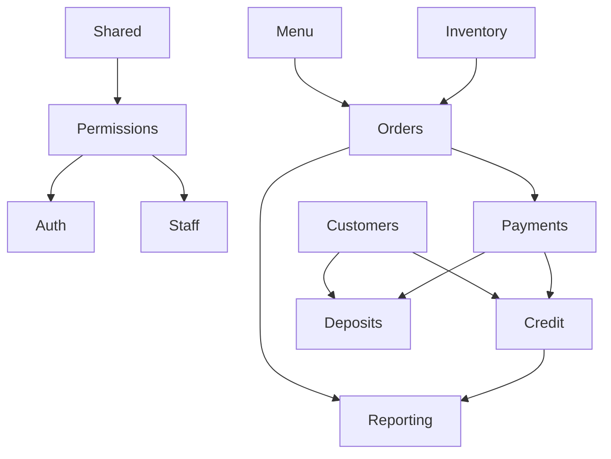

# Bake & Grill — Modular Architecture

Target layout for the Laravel backend modular monolith. Complements [`MODULARIZATION_AUDIT.md`](MODULARIZATION_AUDIT.md).

---

## 1. Principles

1. **API URLs are frozen** — refactor namespaces and folders, not public paths.
2. **Models stay in `app/Models/` initially** — domains use repositories; optional model moves later with aliases.
3. **Controllers become thin** — HTTP in `Domains/*/Controllers/` or legacy `Http/Controllers` delegating to Actions/Services.
4. **Cross-domain communication** — domain events (via `DomainEventServiceProvider`), explicit service interfaces, or Actions. No controller-to-controller calls.
5. **Owner bypass** — `PermissionService::isOwner()` always returns true for permission checks.
6. **BML / print-proxy** — gateways and webhook middleware are change-controlled; tests required before edits.

---

## 2. Module list and responsibilities

```
backend/app/Domains/
├── Shared/           # Money, StateMachine base, shared exceptions, EffectiveDiscount
├── Permissions/      # PermissionCatalog, PermissionService, catalog sync
├── Auth/             # Staff/customer/device token concerns (not Laravel Auth)
├── Staff/            # Schedules, time clock, staff CRUD
├── Customers/        # CRM, addresses, segmentation, analytics
├── Credit/           # House account, ledger, eligibility (NOT deposits)
├── Deposits/           # Prepaid wallet balance, ledger, top-up/refund
├── Orders/           # Lifecycle, creation, totals, state machine (future)
├── Payments/         # Settlement, gateways (BML, Stripe), allocation
├── Shifts/           # Shift open/close, cash movements, shift access
├── Menu/             # Categories, items, variants, specials, POS menu build
├── Inventory/        # Stock, recipes, waste, purchasing
├── Kitchen/          # Production, receiving, variance
├── KitchenDisplay/   # KDS tickets, bump/recall state
├── Delivery/         # Drivers, fees, delivery orders
├── Printing/         # Print jobs, print-proxy client
├── Sms/              # Staff SMS, campaigns, templates, scheduler
├── Notifications/    # Transactional customer SMS, push, payment confirm
├── Promotions/       # Promo codes, redemption
├── Loyalty/          # Points, tiers, holds
├── Gst/              # Tax calculation, ledger, reports
├── Reporting/        # Sales, shift, credit exposure reports
├── Accounting/       # Xero sync
├── Reservations/     # Table bookings
├── PublicWebsite/    # Site settings CMS, opening hours, online ordering gates
├── Marketing/        # Referrals, automation, corporate inquiries
├── System/           # Health, audit logs, maintenance
└── Webhooks/         # Outbound webhook dispatch
```

**Out of core modular scope (keep as-is):** `PrayerTimes/`, `Realtime/` (SSE), `Operations/` (alerts).

---

## 3. Allowed dependencies



| From | May depend on | Must NOT |
|------|---------------|----------|
| **Shared** | — | Any domain |
| **Permissions** | Shared | Orders, Payments |
| **Orders** | Menu, Inventory, Promotions, Loyalty, Payments, Delivery | Direct HTTP controllers |
| **Payments** | Credit, Deposits (via services) | Modify order status without OrderService |
| **Credit** | Customers (read model) | Deposits ledger |
| **Deposits** | Customers (read model) | Credit ledger |
| **Reporting / Gst** | Read models, events | Write order/payment state |
| **Notifications** | Orders, Payments events | Business settlement rules |

---

## 4. Folder convention per domain

```
Domains/{Name}/
├── Actions/          # Single-purpose command handlers (preferred for writes)
├── Controllers/      # Thin HTTP (optional during migration)
├── DTOs/
├── Enums/
├── Events/
├── Listeners/
├── Models/           # Optional later; start empty
├── Policies/
├── Providers/        # {Name}ServiceProvider.php
├── Repositories/
├── Requests/
├── Resources/
├── Services/
├── StateMachine/     # Singular (existing convention)
├── Gateway/          # Payment gateways only
└── Tests/            # Or mirror in backend/tests/Feature/{Name}/
```

---

## 5. Credit vs deposits

| | **Credit** (`house_account`) | **Deposits** (`wallet`) |
|---|------------------------------|-------------------------|
| Meaning | Customer **owes** B&G | Customer **prepaid** balance |
| Approval | `credit_enabled` + manager/owner | Account active; top-up by staff |
| Ledger | `customer_credit_ledger` | `customer_deposit_ledger` |
| Balance field | `customers.credit_balance_laar` | `customer_deposit_accounts.balance_laar` |
| Payment effect | Increases debt | Decreases prepaid balance |
| Offline POS | Blocked | Blocked until implemented |
| Services | `CreditEligibilityService`, `CreditLedgerService` | `DepositEligibilityService`, `DepositLedgerService`, `CustomerDepositService` |

---

## 6. Payments orchestration

```
POST /orders/{id}/payments
        │
        ▼
SettleOrderPaymentAction
        │
        ├── PaymentAllocationService (split tenders)
        ├── CreditLedgerService (if house_account)
        ├── DepositLedgerService (if wallet)
        ├── PaymentService + BmlConnectService (if card/BML — unchanged)
        └── ShiftAccessService (shift attribution)
```

**Do not change:** `BmlWebhookController`, `VerifyBmlSignature`, `BmlConnectService` request/response shapes.

---

## 7. Route organization

```
backend/routes/
├── api.php              # Thin loader: require domain files
├── api_finance.php      # Deprecated → routes/domains/finance.php
├── web.php
└── domains/
    ├── public.php
    ├── auth.php
    ├── customers.php
    ├── credit.php
    ├── deposits.php
    ├── orders.php
    ├── payments.php
    ├── pos.php
    ├── kds.php
    ├── shifts.php
    ├── menu.php
    ├── inventory.php
    ├── delivery.php
    ├── printing.php
    ├── sms.php
    ├── reporting.php
    ├── finance.php
    ├── admin.php
    └── webhooks.php
```

Middleware groups and URL paths are copied verbatim from current `api.php`.

---

## 8. Service providers

Registered in `bootstrap/providers.php`:

| Provider | Binds |
|----------|-------|
| `DomainEventServiceProvider` | Event → listener map (global) |
| `OrderServiceProvider` | OrderRepository |
| `PaymentServiceProvider` | PaymentRepository, settlement actions |
| `LoyaltyServiceProvider` | Loyalty repositories |
| `InventoryServiceProvider` | ItemRepository |
| `PromotionsServiceProvider` | Promotion repositories |
| `ReservationServiceProvider` | ReservationRepository |
| `CreditServiceProvider` | Credit services |
| `DepositsServiceProvider` | Deposit services |
| `PermissionsServiceProvider` | PermissionService |
| `PrintingServiceProvider` | Print proxy client |

Laravel's `App\Providers\AuthServiceProvider` keeps Gate definitions until policies move.

---

## 9. Where to add new features

| Feature type | Location |
|--------------|----------|
| New payment method | `Payments/` + `StoreOrderPaymentsRequest` |
| New order status | `OrderStatusMachine` (prod) then unify with domain SM |
| New report | `Reporting/Services/` |
| New admin API | `Domains/*/Controllers/` + `routes/domains/admin.php` |
| New customer-facing SMS | `Notifications/` |
| New staff SMS campaign | `Sms/` |
| New permission | `PermissionCatalog` + migration seed |
| New CMS key | `PublicWebsite/` or SiteSetting migration |

---

## 10. Frontend integration

| App | Path | API client |
|-----|------|------------|
| Admin | `/admin/` | `apps/admin-dashboard/src/api/` |
| POS | `/pos/` | `apps/pos-web/src/api.ts` |
| KDS | `/kds/` | `apps/kds-web/src/api.ts` + `@shared` |
| Online order | `/order/` | `apps/online-order-web/src/api/` + `@shared` |
| Delivery | `/delivery/` | `apps/delivery-web/src/api.ts` |

Prefer adding endpoint constants to `packages/shared/src/api/endpoints.*.ts` when touching contracts.

---

## 11. Running tests

```bash
# Full backend
cd backend && php artisan test

# Targeted
php artisan test --filter=CustomerCreditTest
php artisan test --filter=DepositsTest
php artisan test --filter=ShiftCashMovementTest

# Frontend builds
./scripts/build-all.sh admin pos kds order delivery

# E2E (against test env)
cd e2e && npx playwright test apps-smoke.spec.ts pos-flow.spec.ts
```

---

## 12. Migration waves (checklist)

- [x] Phase 1: `MODULARIZATION_AUDIT.md`
- [x] Phase 2: `MODULAR_ARCHITECTURE.md` (this file)
- [ ] Wave 1–2: Shared + Permissions + `ShiftCashMovementTest`
- [ ] Wave 5: Credit domain extraction
- [ ] Wave 6: Deposits domain (full)
- [ ] Wave 7: Payment orchestration
- [ ] Domain route split
- [ ] Waves 8–17: Remaining domain moves
- [ ] Frontend builds + final report

---

## 13. Compatibility during migration

When moving a class from `App\Services\Foo` to `App\Domains\Bar\Services\Foo`:

```php
// app/Services/Foo.php — deprecated wrapper
namespace App\Services;

/** @deprecated Use App\Domains\Bar\Services\Foo */
class Foo extends \App\Domains\Bar\Services\Foo {}
```

Remove wrapper only when `rg 'App\\Services\\Foo'` returns zero results.
